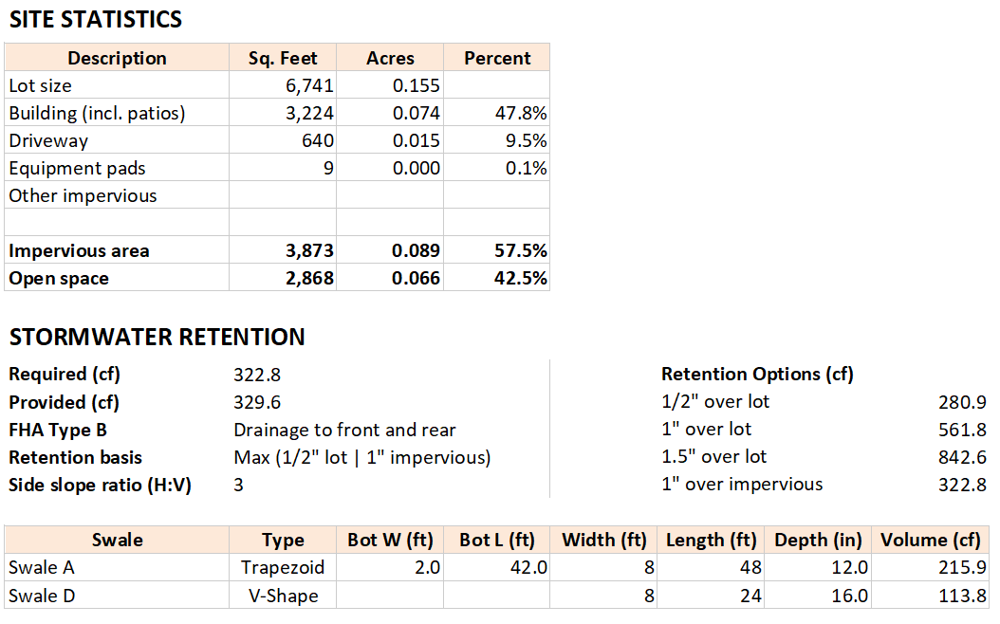

# swale-calculator

Generates the stormwater retention swale calculator Excel workbook (`.xlsx`).



## Why this exists

This workbook provides a quick, consistent check that proposed swales supply the required stormwater retention volume for a residential lot. It standardizes assumptions, formulas, and layout so every project is calculated the same way across the team.

It is used by [Witty Finch Engineering](https://wittyfinch.com) in their residential plan sets.

## How the math works

- Site stats:
	- Acres = `Sq. feet / 43,560`.
	- Percent = each area divided by lot size.
- Required retention (cf): based on selected **Retention basis** option.
	- Default `Max (1/2" lot | 1" impervious)` uses the larger of:
		- `0.5 inch over total lot area`, and
		- `1.0 inch over impervious area`.
	- Other options calculate directly from the chosen basis (`1/2" lot`, `1" lot`, `1.5" lot`, or `1" impervious`).
- Swale volume (cf):
	- `V-Swale` (accounts for sloped short sides): `h × Wt × (2Lt + Lb) / 6`, where
		- `h = depth`,
		- `Wt = top width`,
		- `Lt = top length`,
		- `Lb = max(0, Lt - Wt)`.
	- `T-Swale` (frustum): `h/3 × (A1 + A2 + sqrt(A1×A2))`, where
		- `h = depth`,
		- `A1 = bottom width × bottom length`,
		- `A2 = top width × top length`.
- Provided retention (cf): sum of swales.

## Retention controls

Under **Stormwater Retention**:

- `Retention basis`: `Max (1/2" lot | 1" impervious)`, `1/2" over lot`, `1" over lot`, `1.5" over lot`, or `1" over impervious`.
- `Side slope ratio (H:V)`: global slope constant used by swale geometry formulas.
- `Input highlight`: `ON/OFF` toggle for yellow background on editable input cells.
- `Retention options` chart (right side): shows each basis option with calculated values.

## Built-in guardrails

The workbook includes validation checks to prevent invalid geometry entries.

- `T-Swale` top width and top length must each be at least `2.0 ft`.
- Bottom width/length cells are calculated and locked from manual edits.

## Requirements

- Python 3.10+

## Build

Supports both macOS/Linux and Windows builders (`build/build.sh` and `build\\build.bat`).

The script will:

- create an OS-specific virtualenv if needed (`.venv-linux` or `.venv-windows`),
- install dependencies from `requirements.txt`,
- generate the workbook at `build/swale_calculator.xlsx`.

## Run script directly (optional)

```bash
python3 swale-calculator.py --out build/swale_calculator.xlsx
```
